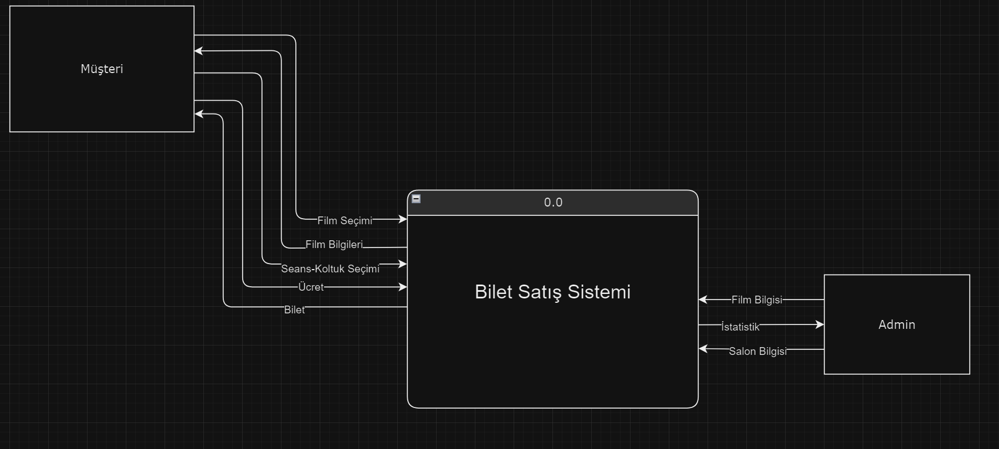
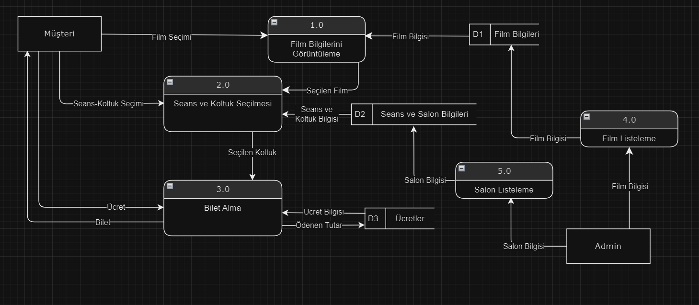

# This file is for storing diagrams.
Images may not be up to date. Click on them to see the latest version.

---

<!--- ## Analysis Diagrams --->

## Design Diagrams

### UML Class Diagram

### Database

